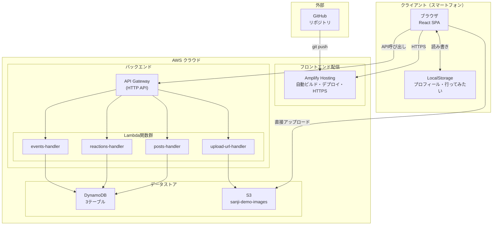
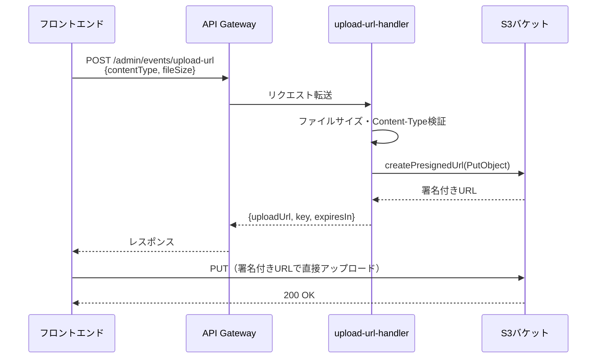
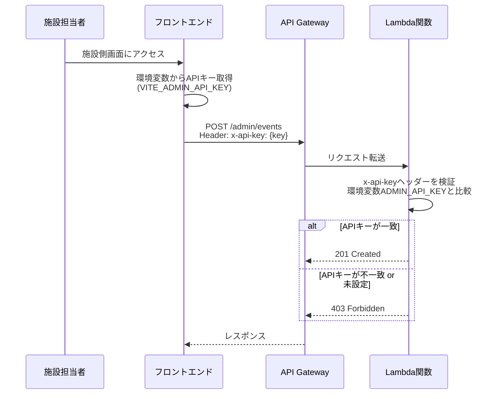
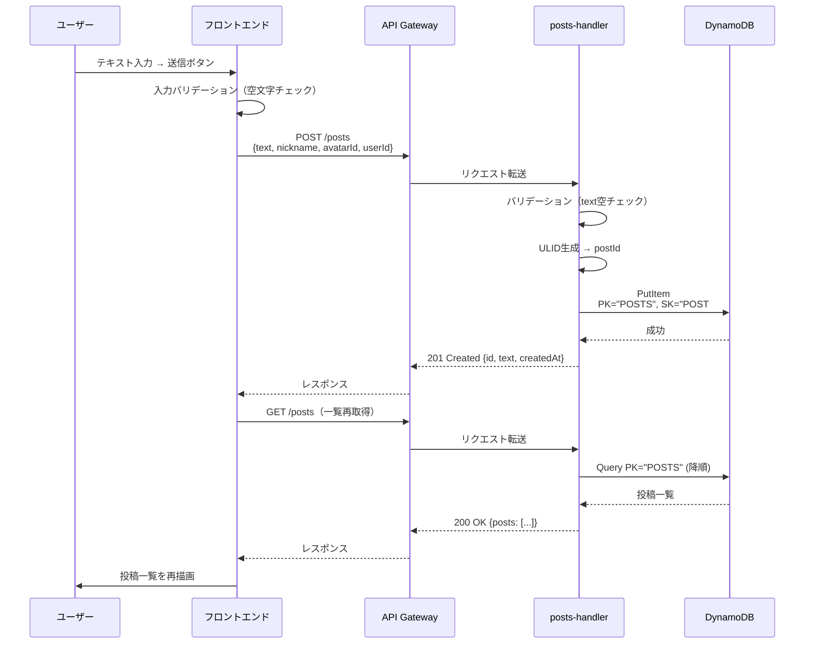
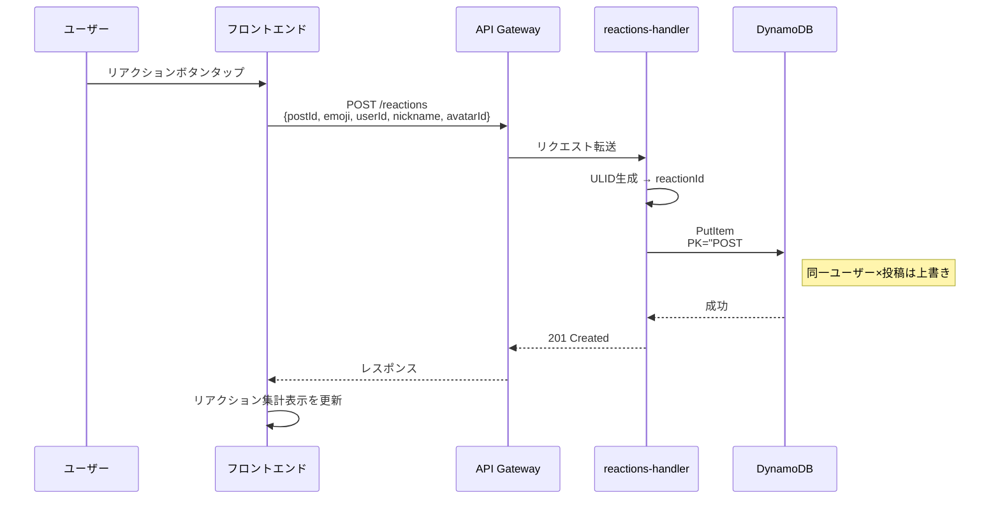
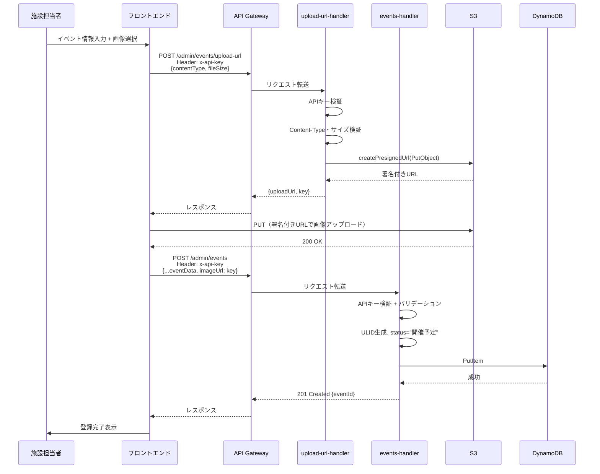

# 「さんじのひろば」AWS構成 技術設計書

## Overview

本設計書は、requirements.mdで定義された「案B: Amplify Hosting + API Gateway + Lambda + DynamoDB + S3」構成に基づき、AWS初心者2名がコンテスト発表用デモを構築するための具体的な技術設計を記述する。

### 設計方針

- **シンプルさ優先**: AWS初心者でも理解・実装できる構成にする
- **サーバーレス**: 全サービスがマネージド型で、サーバー管理不要
- **最小コスト**: 無料利用枠内で運用可能な設計
- **デモ特化**: 本番運用に不要な複雑さを排除する

### 技術スタック

| レイヤー | 技術 |
|---------|------|
| フロントエンド | React 19 + Vite + TypeScript |
| API呼び出し | fetch API（aws-amplifyはHosting連携のみ） |
| バックエンド | AWS Lambda (TypeScript + esbuild) |
| データベース | Amazon DynamoDB |
| ファイルストレージ | Amazon S3 |
| API管理 | Amazon API Gateway (HTTP API) |
| ホスティング | AWS Amplify Hosting |
| ID生成 | ULID |

---

## Architecture

### システム構成図



### データフロー概要

| フロー | 経路 |
|--------|------|
| 画面表示 | ブラウザ → Amplify Hosting → 静的ファイル配信 |
| 投稿・リアクション・イベント取得 | ブラウザ → API Gateway → Lambda → DynamoDB |
| イベント画像アップロード | ブラウザ → API Gateway → Lambda(署名付きURL生成) → ブラウザ → S3(直接アップロード) |
| プロフィール・行ってみたい | ブラウザ ↔ LocalStorage（サーバー通信なし） |

---

## Components and Interfaces

### API設計（API Gateway エンドポイント一覧）

API GatewayはHTTP APIタイプを使用する。ベースURL: `https://{api-id}.execute-api.ap-northeast-1.amazonaws.com`

#### 一般ユーザー向けAPI（認証不要）

| メソッド | パス | 説明 | Lambda関数 |
|---------|------|------|-----------|
| GET | `/posts` | 投稿一覧取得（新しい順） | posts-handler |
| POST | `/posts` | 投稿登録 | posts-handler |
| GET | `/reactions` | リアクション取得（クエリパラメータでフィルタ） | reactions-handler |
| POST | `/reactions` | リアクション登録 | reactions-handler |
| PUT | `/reactions/{id}` | リアクション変更 | reactions-handler |
| DELETE | `/reactions/{id}` | リアクション取消 | reactions-handler |
| GET | `/events` | イベント一覧取得 | events-handler |
| GET | `/events/{id}` | イベント詳細取得 | events-handler |

#### 施設側API（APIキー必須）

| メソッド | パス | 説明 | Lambda関数 |
|---------|------|------|-----------|
| POST | `/admin/events` | イベント登録 | events-handler |
| PATCH | `/admin/events/{id}/status` | イベント開催状態変更 | events-handler |
| POST | `/admin/events/upload-url` | 画像アップロード用署名付きURL取得 | upload-url-handler |

---

### APIリクエスト・レスポンス仕様

#### POST /posts（投稿登録）

```json
// リクエストボディ
{
  "text": "今日は公園で遊びました",
  "nickname": "ひまわりママ",
  "avatarId": "avatar-01"
}

// レスポンス (201 Created)
{
  "id": "01HXYZ...",
  "text": "今日は公園で遊びました",
  "nickname": "ひまわりママ",
  "avatarId": "avatar-01",
  "createdAt": "2025-01-15T10:30:00.000Z"
}
```

#### GET /posts（投稿一覧取得）

```json
// クエリパラメータ: ?limit=20&cursor=01HXYZ...（ページネーション用、任意）

// レスポンス (200 OK)
{
  "posts": [
    {
      "id": "01HXYZ...",
      "text": "今日は公園で遊びました",
      "nickname": "ひまわりママ",
      "avatarId": "avatar-01",
      "createdAt": "2025-01-15T10:30:00.000Z",
      "reactions": { "wakaru": 1, "otsukare": 3, "kokoniiruyo": 2, "watashimo": 0, "ouen": 0, "kyoumo": 0, "yokattane": 0, "hitoiki": 0 }
    }
  ],
  "nextCursor": "01HABC..." // 次ページがない場合はnull
}
```

#### POST /reactions（リアクション登録）

```json
// リクエストボディ
{
  "postId": "01HXYZ...",
  "emoji": "otsukare",
  "userId": "user-ulid-xxx",
  "nickname": "ひまわりママ",
  "avatarId": "avatar-01"
}

// レスポンス (201 Created)
{
  "id": "01HABC...",
  "postId": "01HXYZ...",
  "emoji": "otsukare",
  "userId": "user-ulid-xxx",
  "createdAt": "2025-01-15T10:35:00.000Z"
}
```

#### GET /reactions（リアクション取得）

```json
// クエリパラメータ: ?postId=01HXYZ...&emoji=otsukare

// レスポンス (200 OK)
{
  "reactions": [
    {
      "id": "01HABC...",
      "userId": "user-ulid-xxx",
      "nickname": "ひまわりママ",
      "avatarId": "avatar-01",
      "emoji": "otsukare",
      "createdAt": "2025-01-15T10:35:00.000Z"
    }
  ]
}
```

#### POST /admin/events（イベント登録）

```json
// リクエストヘッダー: x-api-key: {施設側APIキー}
// リクエストボディ
{
  "providerName": "博多区東公民館",
  "eventName": "親子でリトミック♪",
  "eventDate": "2025-02-01",
  "startTime": "10:00",
  "endTime": "11:00",
  "ageGroup": "0〜2歳",
  "location": "博多区東公民館 2F多目的室",
  "description": "音楽に合わせて体を動かす親子リトミック教室です",
  "tags": ["リトミック", "無料", "予約不要"],
  "officialUrl": "https://example.com",
  "imageUrl": "events/01HXYZ.../image.jpg"  // S3キー（画像アップ済みの場合）
}

// レスポンス (201 Created)
{
  "eventId": "01HXYZ...",
  "status": "開催予定",
  "createdAt": "2025-01-15T10:00:00.000Z"
}
```

#### PATCH /admin/events/{id}/status（開催状態変更）

```json
// リクエストヘッダー: x-api-key: {施設側APIキー}
// リクエストボディ
{
  "status": "中止"
}

// レスポンス (200 OK)
{
  "eventId": "01HXYZ...",
  "status": "中止",
  "updatedAt": "2025-01-16T09:00:00.000Z"
}
```

#### POST /admin/events/upload-url（署名付きURL取得）

```json
// リクエストヘッダー: x-api-key: {施設側APIキー}
// リクエストボディ
{
  "contentType": "image/jpeg",
  "fileSize": 2048000
}

// レスポンス (200 OK)
{
  "uploadUrl": "https://sanji-demo-images.s3.ap-northeast-1.amazonaws.com/events/01HXYZ.../image.jpg?X-Amz-...",
  "key": "events/01HXYZ.../image.jpg",
  "expiresIn": 300
}
```

#### GET /events（イベント一覧取得）

```json
// クエリパラメータ: ?ids=01H...,01H... （行ってみたい一覧用、任意）

// レスポンス (200 OK)
{
  "events": [
    {
      "eventId": "01HXYZ...",
      "providerName": "博多区東公民館",
      "eventName": "親子でリトミック♪",
      "eventDate": "2025-02-01",
      "startTime": "10:00",
      "endTime": "11:00",
      "ageGroup": "0〜2歳",
      "location": "博多区東公民館 2F多目的室",
      "description": "...",
      "tags": ["リトミック", "無料"],
      "officialUrl": "https://example.com",
      "status": "開催予定",
      "imageUrl": "https://sanji-demo-images.s3.../events/01HXYZ.../image.jpg?signed...",
      "createdAt": "2025-01-15T10:00:00.000Z",
      "updatedAt": "2025-01-15T10:00:00.000Z"
    }
  ]
}
```

---

### Lambda関数設計

#### 分割方針: 機能別4関数

Lambda関数は**機能別に4つ**に分割する。理由:

- 各関数の責務が明確で、デバッグしやすい
- 1関数あたりのコード量が少なく、初心者でも理解しやすい
- デプロイ時に影響範囲が限定される

| 関数名 | 責務 | トリガー |
|--------|------|---------|
| `sanji-demo-posts-handler` | 投稿の登録・一覧取得 | API Gateway |
| `sanji-demo-reactions-handler` | リアクションの登録・変更・取消・取得 | API Gateway |
| `sanji-demo-events-handler` | イベントの登録・取得・状態変更 | API Gateway |
| `sanji-demo-upload-url-handler` | S3署名付きURL生成 | API Gateway |

#### Lambda関数の共通設定

| 設定項目 | 値 |
|---------|-----|
| ランタイム | Node.js 20.x |
| メモリ | 128 MB |
| タイムアウト | 10秒 |
| リージョン | ap-northeast-1（東京） |
| バンドル | esbuild（TypeScript → JavaScript） |
| 環境変数 | `TABLE_POSTS`, `TABLE_REACTIONS`, `TABLE_EVENTS`, `S3_BUCKET`, `ADMIN_API_KEY` |

#### 各関数のルーティング

各Lambda関数内で、HTTPメソッドとパスに基づいてハンドラを振り分ける:

```typescript
// posts-handler の例
export const handler = async (event: APIGatewayProxyEventV2) => {
  const { httpMethod, routeKey } = event.requestContext;

  switch (routeKey) {
    case 'GET /posts':
      return getPosts(event);
    case 'POST /posts':
      return createPost(event);
    default:
      return { statusCode: 404, body: JSON.stringify({ error: 'Not Found' }) };
  }
};
```

---

### S3画像保存設計

#### バケット設定

| 項目 | 値 |
|------|-----|
| バケット名 | `sanji-demo-images` |
| リージョン | ap-northeast-1（東京） |
| パブリックアクセス | 全ブロック（Block all public access） |
| バージョニング | 無効（デモのため不要） |
| 暗号化 | SSE-S3（デフォルト暗号化） |

#### オブジェクトキーの命名規則

```
events/{eventId}/image.{拡張子}
```

例: `events/01HXYZ123ABC/image.jpg`

- `eventId`はULIDで生成されるため、一意性が保証される
- 1イベント1画像のため、ファイル名は固定で`image.{ext}`

#### 署名付きURL生成仕様

| 項目 | 値 |
|------|-----|
| 操作 | PutObject（アップロード用） |
| 有効期限 | 300秒（5分） |
| Content-Type制限 | `image/jpeg` または `image/png` のみ |
| Content-Length制限 | 最大 5MB (5,242,880 bytes) |
| 取得用署名付きURL | GetObject、有効期限 3600秒（1時間） |

#### 画像アップロードフロー



---

### フロントエンドとバックエンドの接続設計

#### 環境変数（Amplify Hosting側で設定）

| 環境変数名 | 値の例 | 説明 |
|-----------|--------|------|
| `VITE_API_BASE_URL` | `https://{api-id}.execute-api.ap-northeast-1.amazonaws.com` | API GatewayのエンドポイントURL |
| `VITE_ADMIN_API_KEY` | `sanji-demo-admin-key-2025` | 施設側APIキー（ビルド時埋め込み） |

#### API呼び出し方式

フロントエンドからのAPI呼び出しは`fetch` APIを使用する（追加ライブラリ不要）:

```typescript
// frontend/src/api/client.ts
const API_BASE = import.meta.env.VITE_API_BASE_URL;

export async function apiGet<T>(path: string): Promise<T> {
  const res = await fetch(`${API_BASE}${path}`);
  if (!res.ok) throw new ApiError(res.status, await res.text());
  return res.json();
}

export async function apiPost<T>(path: string, body: unknown, options?: { apiKey?: string }): Promise<T> {
  const headers: Record<string, string> = { 'Content-Type': 'application/json' };
  if (options?.apiKey) headers['x-api-key'] = options.apiKey;

  const res = await fetch(`${API_BASE}${path}`, {
    method: 'POST',
    headers,
    body: JSON.stringify(body),
  });
  if (!res.ok) throw new ApiError(res.status, await res.text());
  return res.json();
}
```

#### エラーハンドリング方針

| HTTPステータス | フロントエンドの対応 |
|---------------|-------------------|
| 400 Bad Request | 入力値エラーメッセージを表示 |
| 403 Forbidden | 「アクセス権限がありません」と表示 |
| 404 Not Found | 「データが見つかりません」と表示 |
| 500 Internal Server Error | 「サーバーエラーが発生しました。しばらくしてから再試行してください」と表示 |
| ネットワークエラー | 「通信に失敗しました。接続を確認してください」と表示 |

---

### 施設側アクセス制限の設計

#### 方式: カスタムヘッダーによるAPIキー検証

API Gatewayの組み込みAPIキー機能（Usage Plan方式）は設定が複雑なため、**Lambda関数内でカスタムヘッダーを検証する方式**を採用する。

#### フロー



#### APIキーの管理

| 項目 | 内容 |
|------|------|
| キーの形式 | ランダム文字列（例: `sanji-demo-admin-2025-xxxx`） |
| 保存場所（Lambda側） | Lambda環境変数 `ADMIN_API_KEY` |
| 保存場所（フロント側） | Amplify環境変数 `VITE_ADMIN_API_KEY`（ビルド時埋め込み） |
| 検証方法 | Lambda関数内で `event.headers['x-api-key'] === process.env.ADMIN_API_KEY` |
| 変更方法 | Lambda環境変数とAmplify環境変数を両方更新 |

#### 注意事項

- この方式はデモ用の簡易制限であり、本番環境では不十分
- フロントエンドにAPIキーが埋め込まれるため、ブラウザのデバッグツールで確認可能
- デモ期間中の不正登録を防ぐ最低限の対策として採用

---

### IAMロール・ポリシー設計

#### Lambda実行ロール

ロール名: `sanji-demo-lambda-role`

```json
{
  "Version": "2012-10-17",
  "Statement": [
    {
      "Sid": "DynamoDBAccess",
      "Effect": "Allow",
      "Action": [
        "dynamodb:GetItem",
        "dynamodb:PutItem",
        "dynamodb:UpdateItem",
        "dynamodb:DeleteItem",
        "dynamodb:Query",
        "dynamodb:Scan"
      ],
      "Resource": [
        "arn:aws:dynamodb:ap-northeast-1:{account-id}:table/sanji-demo-posts",
        "arn:aws:dynamodb:ap-northeast-1:{account-id}:table/sanji-demo-posts/index/*",
        "arn:aws:dynamodb:ap-northeast-1:{account-id}:table/sanji-demo-reactions",
        "arn:aws:dynamodb:ap-northeast-1:{account-id}:table/sanji-demo-reactions/index/*",
        "arn:aws:dynamodb:ap-northeast-1:{account-id}:table/sanji-demo-events",
        "arn:aws:dynamodb:ap-northeast-1:{account-id}:table/sanji-demo-events/index/*"
      ]
    },
    {
      "Sid": "S3Access",
      "Effect": "Allow",
      "Action": [
        "s3:PutObject",
        "s3:GetObject"
      ],
      "Resource": "arn:aws:s3:::sanji-demo-images/*"
    },
    {
      "Sid": "CloudWatchLogs",
      "Effect": "Allow",
      "Action": [
        "logs:CreateLogGroup",
        "logs:CreateLogStream",
        "logs:PutLogEvents"
      ],
      "Resource": "arn:aws:logs:ap-northeast-1:{account-id}:*"
    }
  ]
}
```

#### 信頼ポリシー（Trust Policy）

```json
{
  "Version": "2012-10-17",
  "Statement": [
    {
      "Effect": "Allow",
      "Principal": { "Service": "lambda.amazonaws.com" },
      "Action": "sts:AssumeRole"
    }
  ]
}
```

---

### Amplify Hosting設定

#### amplify.yml（ビルド設定）

```yaml
version: 1
frontend:
  phases:
    preBuild:
      commands:
        - cd frontend
        - npm ci
    build:
      commands:
        - npm run build
  artifacts:
    baseDirectory: frontend/dist
    files:
      - '**/*'
  cache:
    paths:
      - frontend/node_modules/**/*
```

#### Amplify環境変数

| 変数名 | 値 | 説明 |
|--------|-----|------|
| `VITE_API_BASE_URL` | `https://{api-id}.execute-api.ap-northeast-1.amazonaws.com` | APIエンドポイント |
| `VITE_ADMIN_API_KEY` | `sanji-demo-admin-2025-xxxx` | 施設側APIキー |

#### ブランチ接続

| 設定 | 値 |
|------|-----|
| リポジトリ | GitHub上の`sanji-no-hiroba`リポジトリ |
| 接続ブランチ | `main` |
| 自動ビルド | 有効（mainへのpushで自動デプロイ） |
| フレームワーク検出 | Vite（自動検出） |

---

### CORS設定

API Gateway (HTTP API) でのCORS設定:

| 項目 | 値 |
|------|-----|
| Allow Origins | `https://main.{app-id}.amplifyapp.com` |
| Allow Methods | `GET, POST, PUT, PATCH, DELETE, OPTIONS` |
| Allow Headers | `Content-Type, x-api-key` |
| Max Age | `86400`（24時間） |

#### 設定場所

API Gateway HTTP APIのCORS設定はコンソールから一括設定可能:
1. API Gatewayコンソール → 対象API → 「CORS」タブ
2. 上記の値を入力して保存

#### 注意点

- `Allow Origins`にはAmplifyのデフォルトドメインを正確に指定する
- 開発中は`http://localhost:5173`も追加すると便利（デプロイ前に削除すること）
- `x-api-key`ヘッダーを`Allow Headers`に含めないと、施設側APIが呼べない

---

### ユーザー識別方式

ログイン機能がないため、LocalStorageでユーザーを識別する。

#### ユーザーID生成と保存

```typescript
// frontend/src/utils/userId.ts
import { ulid } from 'ulid';

const USER_ID_KEY = 'sanji-user-id';

export function getUserId(): string {
  let id = localStorage.getItem(USER_ID_KEY);
  if (!id) {
    id = ulid();
    localStorage.setItem(USER_ID_KEY, id);
  }
  return id;
}
```

#### LocalStorageに保存するデータ

| キー | 値の形式 | 説明 |
|------|---------|------|
| `sanji-user-id` | `string` (ULID) | ユーザー識別ID（初回アクセス時に自動生成） |
| `sanji-profile` | `{ nickname: string, avatarId: string, childAgeGroup: string }` | プロフィール情報 |
| `sanji-saved-events` | `string[]` (イベントIDの配列) | 「行ってみたい」リスト |

#### 制約事項

- ブラウザのデータ消去でユーザーIDが失われる（リアクション等の紐付けが切れる）
- 別端末・別ブラウザからは別ユーザーとして扱われる
- デモ用途のため、これらの制約は許容する

---

## Data Models

### DynamoDBテーブル設計

#### テーブル一覧

| テーブル名 | 用途 | キャパシティモード |
|-----------|------|------------------|
| `sanji-demo-posts` | 投稿データ | オンデマンド |
| `sanji-demo-reactions` | リアクションデータ | オンデマンド |
| `sanji-demo-events` | イベントデータ | オンデマンド |

---

### 投稿テーブル（sanji-demo-posts）

#### キー設計

| キー種別 | 属性名 | 型 | 説明 |
|---------|--------|------|------|
| パーティションキー (PK) | `pk` | String | 固定値 `"POSTS"` |
| ソートキー (SK) | `sk` | String | `"POST#{postId}"` (ULIDの降順で新しい順) |

#### アクセスパターン

| パターン | 操作 | 条件 |
|---------|------|------|
| 投稿一覧取得（新しい順） | Query | PK = "POSTS", SK降順, Limit指定 |
| 投稿登録 | PutItem | — |

#### 属性一覧

| 属性名 | 型 | 必須 | 説明 |
|--------|------|------|------|
| `pk` | String | ○ | パーティションキー: `"POSTS"` |
| `sk` | String | ○ | ソートキー: `"POST#{postId}"` |
| `postId` | String | ○ | 投稿ID (ULID) |
| `text` | String | ○ | 投稿テキスト |
| `nickname` | String | ○ | ニックネーム |
| `avatarId` | String | ○ | アバターID |
| `userId` | String | ○ | ユーザーID (ULID) |
| `createdAt` | String | ○ | 投稿日時 (ISO 8601) |

#### 設計理由

- PKを固定値`"POSTS"`にすることで、全投稿を1パーティションに集約
- SKにULID（時刻順ソート可能）を使うことで、Query一発で新しい順に取得可能
- デモ規模（投稿100件程度）ではホットパーティション問題は発生しない

---

### リアクションテーブル（sanji-demo-reactions）

#### キー設計

| キー種別 | 属性名 | 型 | 説明 |
|---------|--------|------|------|
| パーティションキー (PK) | `pk` | String | `"POST#{postId}"` |
| ソートキー (SK) | `sk` | String | `"REACTION#{userId}"` |

#### GSI（グローバルセカンダリインデックス）

| GSI名 | PK | SK | 用途 |
|--------|-----|-----|------|
| `gsi-post-emoji` | `pk` | `emoji` | 投稿×絵文字でのリアクション取得 |

#### アクセスパターン

| パターン | 操作 | 条件 |
|---------|------|------|
| 投稿のリアクション集計 | Query | PK = "POST#{postId}" |
| 投稿×絵文字のリアクションユーザー一覧 | Query (GSI) | PK = "POST#{postId}", emoji = {emoji} |
| リアクション登録/更新 | PutItem | — |
| リアクション削除 | DeleteItem | PK + SK指定 |
| 同一ユーザーの重複チェック | GetItem | PK + SK指定 |

#### 属性一覧

| 属性名 | 型 | 必須 | 説明 |
|--------|------|------|------|
| `pk` | String | ○ | パーティションキー: `"POST#{postId}"` |
| `sk` | String | ○ | ソートキー: `"REACTION#{userId}"` |
| `reactionId` | String | ○ | リアクションID (ULID) |
| `postId` | String | ○ | 対象投稿ID |
| `userId` | String | ○ | リアクションしたユーザーID |
| `emoji` | String | ○ | 絵文字種別 ("wakaru" / "otsukare" / "kokoniiruyo" / "watashimo" / "ouen" / "kyoumo" / "yokattane" / "hitoiki") |
| `nickname` | String | ○ | ニックネーム |
| `avatarId` | String | ○ | アバターID |
| `createdAt` | String | ○ | リアクション日時 (ISO 8601) |

#### 設計理由

- PK=`POST#{postId}`, SK=`REACTION#{userId}`で「1ユーザー1投稿1リアクション」を制約
- 同じユーザーが同じ投稿にPutItemすると上書き（変更として扱われる）
- GSIで絵文字別のユーザー一覧を効率的に取得可能

---

### イベントテーブル（sanji-demo-events）

#### キー設計

| キー種別 | 属性名 | 型 | 説明 |
|---------|--------|------|------|
| パーティションキー (PK) | `pk` | String | 固定値 `"EVENTS"` |
| ソートキー (SK) | `sk` | String | `"EVENT#{eventId}"` |

#### GSI（グローバルセカンダリインデックス）

| GSI名 | PK | SK | 用途 |
|--------|-----|-----|------|
| `gsi-date` | `pk` | `eventDate` | 開催日順でのイベント一覧取得 |

#### アクセスパターン

| パターン | 操作 | 条件 |
|---------|------|------|
| イベント一覧取得（日付順） | Query (GSI) | PK = "EVENTS", eventDate で絞り込み |
| 特定イベント取得 | GetItem | PK + SK指定 |
| 複数イベント取得（行ってみたい） | BatchGetItem | PK + SK を複数指定 |
| イベント登録 | PutItem | — |
| イベント状態更新 | UpdateItem | status, updatedAt を更新 |

#### 属性一覧

| 属性名 | 型 | 必須 | 説明 |
|--------|------|------|------|
| `pk` | String | ○ | パーティションキー: `"EVENTS"` |
| `sk` | String | ○ | ソートキー: `"EVENT#{eventId}"` |
| `eventId` | String | ○ | イベントID (ULID) |
| `providerName` | String | ○ | 情報提供元・施設名 |
| `eventName` | String | ○ | イベント名 |
| `eventDate` | String | ○ | 開催日 (YYYY-MM-DD) |
| `startTime` | String | ○ | 開始時間 (HH:MM) |
| `endTime` | String | ○ | 終了時間 (HH:MM) |
| `ageGroup` | String | ○ | 対象年齢区分 |
| `location` | String | ○ | 開催場所 |
| `description` | String | ○ | イベントの説明 |
| `tags` | List | ○ | タグ一覧 |
| `officialUrl` | String | − | 公式サイトURL |
| `status` | String | ○ | 開催状態 |
| `imageUrl` | String | − | S3画像キー（未設定時はnull） |
| `createdAt` | String | ○ | 登録日時 (ISO 8601) |
| `updatedAt` | String | ○ | 更新日時 (ISO 8601) |

#### 設計理由

- PKを固定値にしてイベント一覧のQuery取得を簡素化
- GSI `gsi-date`で日付順取得を効率化（掲示板表示用）
- statusフィールドの更新のみで「中止・延期」に対応（レコード削除しない）

---

### データフロー図（主要処理のシーケンス図）

#### 投稿登録フロー



#### リアクション登録フロー



#### イベント登録（画像あり）フロー



---

## Error Handling

### Lambda関数のエラーハンドリング方針

#### 共通エラーレスポンス形式

```typescript
interface ErrorResponse {
  error: string;      // エラー種別（コード）
  message: string;    // 人間が読めるメッセージ
}
```

#### エラー分類と対応

| カテゴリ | HTTPステータス | 例 | Lambda側の処理 |
|---------|--------------|-----|---------------|
| バリデーションエラー | 400 | 空テキスト投稿、不正なemoji値 | リクエストボディの検証で即返却 |
| 認証エラー | 403 | APIキー不一致・未設定 | ヘッダー検証で即返却 |
| リソース不存在 | 404 | 存在しないイベントID | DynamoDB GetItem結果がnull |
| サーバーエラー | 500 | DynamoDB接続失敗 | try-catchで捕捉、ログ出力後に返却 |

#### Lambda関数の共通レスポンスヘルパー

```typescript
// backend/shared/response.ts
export function success(body: unknown, statusCode = 200) {
  return {
    statusCode,
    headers: { 'Content-Type': 'application/json' },
    body: JSON.stringify(body),
  };
}

export function error(statusCode: number, error: string, message: string) {
  console.error(`[${error}] ${message}`);
  return {
    statusCode,
    headers: { 'Content-Type': 'application/json' },
    body: JSON.stringify({ error, message }),
  };
}
```

### 入力バリデーション規則

| フィールド | 規則 | エラー時メッセージ |
|-----------|------|-----------------|
| `text`（投稿テキスト） | 1〜60文字、空白のみ不可 | "投稿テキストは1〜60文字で入力してください" |
| `emoji`（リアクション種別） | "wakaru", "otsukare", "kokoniiruyo", "watashimo", "ouen", "kyoumo", "yokattane", "hitoiki"のいずれか | "無効なリアクション種別です" |
| `status`（開催状態） | 5種類のいずれか | "無効な開催状態です" |
| `contentType`（画像） | "image/jpeg" or "image/png" | "JPEG または PNG のみアップロード可能です" |
| `fileSize`（画像サイズ） | 1〜5,242,880 bytes | "ファイルサイズは5MB以下にしてください" |
| `eventName`（イベント名） | 1〜100文字 | "イベント名は1〜100文字で入力してください" |
| `eventDate`（開催日） | YYYY-MM-DD形式 | "開催日の形式が不正です" |

### CloudWatch Logsへのログ出力

```typescript
// エラー時のログ出力例
console.error(JSON.stringify({
  level: 'ERROR',
  function: 'posts-handler',
  action: 'createPost',
  error: err.message,
  requestId: event.requestContext.requestId,
  timestamp: new Date().toISOString(),
}));
```

- ログ保持期間: 7日間（CloudWatch Logsの設定で制限）
- ログレベル: INFO（正常処理）、ERROR（エラー発生時）のみ

---

## Testing Strategy

### PBTの適用判断

本機能はProperty-Based Testing（PBT）に**適さない**。理由:

- **Infrastructure構成が中心**: AWSサービスの設定・接続が主な作業であり、テスト可能な純粋関数が限定的
- **CRUD操作が主体**: Lambda関数の処理はDynamoDBへの単純な読み書きで、複雑なデータ変換がない
- **外部依存が大きい**: 全てのLambda関数がDynamoDBやS3に依存しており、純粋なロジック部分が少ない

### テスト方針

デモ用途のため、テストは**手動確認**と**最小限の自動テスト**を組み合わせる。

#### 1. 手動テスト（API動作確認）

各APIエンドポイントの動作確認をcurlコマンドで実施する:

```bash
# 投稿登録テスト
curl -X POST https://{api-url}/posts \
  -H "Content-Type: application/json" \
  -d '{"text":"テスト投稿","nickname":"テスト太郎","avatarId":"avatar-01","userId":"test-user-01"}'

# 投稿一覧取得テスト
curl https://{api-url}/posts

# リアクション登録テスト
curl -X POST https://{api-url}/reactions \
  -H "Content-Type: application/json" \
  -d '{"postId":"01HXYZ...","emoji":"otsukare","userId":"test-user-01","nickname":"テスト太郎","avatarId":"avatar-01"}'

# イベント登録テスト（APIキー付き）
curl -X POST https://{api-url}/admin/events \
  -H "Content-Type: application/json" \
  -H "x-api-key: {your-api-key}" \
  -d '{"providerName":"テスト施設","eventName":"テストイベント","eventDate":"2025-02-01","startTime":"10:00","endTime":"11:00","ageGroup":"0〜3歳","location":"テスト会場","description":"テスト説明","tags":["テスト"]}'

# APIキーなしでの拒否確認
curl -X POST https://{api-url}/admin/events \
  -H "Content-Type: application/json" \
  -d '{"eventName":"不正登録テスト"}'
# → 403が返ることを確認
```

#### 2. バリデーションの単体テスト

Lambda関数内のバリデーションロジックのみ、ユニットテストを作成する:

```typescript
// backend/functions/__tests__/validation.test.ts
import { describe, it, expect } from 'vitest';
import { validatePost, validateReaction, validateEvent } from '../shared/validation';

describe('validatePost', () => {
  it('空文字の投稿を拒否する', () => {
    expect(validatePost({ text: '', nickname: 'test', avatarId: 'a1', userId: 'u1' }))
      .toEqual({ valid: false, error: '投稿テキストは1〜60文字で入力してください' });
  });

  it('空白のみの投稿を拒否する', () => {
    expect(validatePost({ text: '   ', nickname: 'test', avatarId: 'a1', userId: 'u1' }))
      .toEqual({ valid: false, error: '投稿テキストは1〜60文字で入力してください' });
  });

  it('正常な投稿を許可する', () => {
    expect(validatePost({ text: 'こんにちは', nickname: 'test', avatarId: 'a1', userId: 'u1' }))
      .toEqual({ valid: true });
  });
});

describe('validateReaction', () => {
  it('無効なemoji種別を拒否する', () => {
    expect(validateReaction({ postId: 'p1', emoji: 'invalid', userId: 'u1' }))
      .toEqual({ valid: false, error: '無効なリアクション種別です' });
  });
});
```

#### 3. 統合テスト（E2E確認）

デプロイ後に以下のシナリオを手動で確認する:

| テスト | 確認事項 |
|--------|---------|
| 投稿→表示 | 投稿した内容が一覧に新しい順で表示される |
| リアクション→集計表示 | リアクションが集計に正しく反映される |
| リアクション変更 | 絵文字を変更すると前のリアクションが上書きされる |
| リアクション取消 | 取り消すと集計から削除される |
| リアクショングループ表示 | 同じ絵文字のユーザー一覧が表示される |
| イベント登録（画像あり） | 画像がS3にアップロードされ、イベントに紐付く |
| イベント登録（画像なし） | 画像なしでもイベント登録が成功する |
| イベント状態変更 | 「中止」に変更すると一覧にも反映される |
| 行ってみたい保存 | ボタンを押すとLocalStorageに保存される |
| 行ってみたい一覧 | 保存したイベントの最新情報が表示される |
| APIキー不正 | 施設側APIにキーなしでアクセスすると403が返る |
| CORS | フロントエンドからAPIが正常に呼べる |
| 画像サイズ超過 | 5MB超の画像アップロードが拒否される |

#### 4. テスト環境

- バリデーションテストのみ`vitest`でローカル実行
- 統合テストはAWSデプロイ後に手動実施
- テストコマンド: `cd backend && npx vitest --run`

---

## バックエンドプロジェクト構成

```
backend/
├── package.json
├── tsconfig.json
├── shared/
│   ├── response.ts        # レスポンスヘルパー
│   ├── validation.ts      # バリデーション関数
│   └── dynamodb.ts        # DynamoDB クライアント初期化
├── functions/
│   ├── posts-handler/
│   │   └── index.ts       # 投稿 CRUD
│   ├── reactions-handler/
│   │   └── index.ts       # リアクション CRUD
│   ├── events-handler/
│   │   └── index.ts       # イベント CRUD + 状態変更
│   └── upload-url-handler/
│       └── index.ts       # 署名付きURL生成
└── __tests__/
    └── validation.test.ts  # バリデーション単体テスト
```

---

## 設計上の判断とその理由

| 判断 | 理由 |
|------|------|
| Lambda関数を4つに分割 | 1つにまとめると肥大化し、初心者には読みにくい。機能別に分けることでデバッグも容易 |
| DynamoDBのPKを固定値にする | デモ規模（数百レコード）ではパーティション分散不要。Query一発で全件取得できるシンプルさを優先 |
| APIキーをLambda内で検証 | API Gateway Usage Planは設定が複雑。Lambda内の文字列比較なら初心者でも理解可能 |
| fetch APIを直接使用 | axiosやaws-amplify/apiの追加依存なし。ブラウザ標準APIのため学習コストが低い |
| 署名付きURLで画像アップロード | Lambda関数の最大ペイロード6MBの制約を回避。S3への直接アップロードで効率的 |
| ULIDでID生成 | 時刻順ソート可能 + ユニーク性保証。DynamoDBのソートキーとして最適 |
| リアクションテーブルのSKにuserIdを含める | 「同一ユーザーが同じ投稿にPutItemすると上書き」をDB制約で実現 |
| LocalStorageでユーザー管理 | Cognito不要でログイン画面も不要。デモの簡易さを最優先 |
